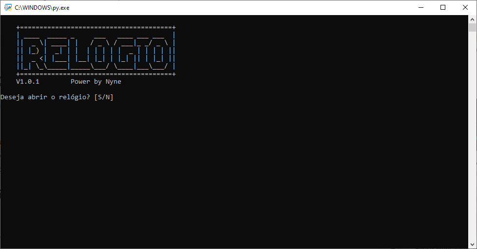

  
  
<strong>Clique no relógio para ver ao vivo</strong>

# 🕒 Relogio-flutuante

RELOGIO flutuante v1.0.1
[RELOGIO v1.0.1.zip](https://github.com/user-attachments/files/29105475/RELOGIO.v1.0.0.zip)
NOVA VERSÃO!
- Corrigido um bug de crash inesperado que acontecia durante a inicialização da versão 1.0.0
- Estabilidade e desempenho melhorados.
- Atualização recomendada para todos os usuários.
Novas versões serão lançadas em breve :)

## 💻Compatibilidade
Este projeto foi testado e funciona corretamente em:
- **Windows** (todas as versões recentes)

## 📥 Download

## ✨ Recursos

- ✅ Relógio em tempo real
- ✅ Janela flutuante
- ✅ Baixo consumo de memória
- ✅ Inicialização rápida
- 🚧 Temas personalizados
- 🚧 Transparência avançada

## 📜 Changelog

### v1.0.1
- Corrigido crash na inicialização
- Melhorias de desempenho

### v1.0.0
- Primeira versão pública

criado por: nyne1155
